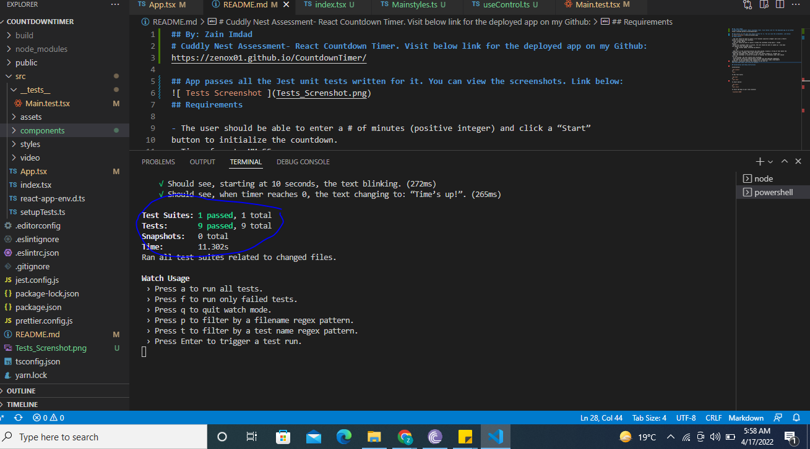

## By: Zain Imdad
# Cuddly Nest Assessment- React Countdown Timer. Visit below link for the deployed app on my Github:
https://zenox01.github.io/CountdownTimer/

## App passes all the Jest unit tests written for it. You can view the screenshots. Link below:

## Requirements

- The user should be able to enter a # of minutes (positive integer) and click a “Start”
button to initialize the countdown.
- Timer format: MM:SS
- The user should be able to pause & resume the countdown using pause / resume
buttons.
- While the countdown timer is active, the user should be able to speed up / slow down
the speed at the following rates:
	- 1.0X (normal speed, selected by default)
	- 1.5X
	- 2X
- When half of the selected duration has been passed, display a string of text above the
countdown timer reading: “More than halfway there!”
- When the countdown timer reaches 0, this text should change to: “Time’s up!”
- When the countdown is within 20 seconds of ending, the countdown timer text should
turn red.
- At 10 seconds, the text should start blinking.
- Functionality should be appropriately divided into well-defined components.
- The look of the countdown timer should have a production-ready clean/modern
aesthetic. Creatively stylize the elements as you see fit.
## EXTRA WORK/FEATURES IN APP:
1. Reset Button, this countdown timer can be reset.
2. The App has a Video Background
3. Form onSubmit submission i.e  timer can be started by hitting 'Enter' key as well and the page will not reload.
4. All State Mangement handled wtih UseReducer hook.

## Installation and Setup Instructions

Installation:

`npm install`
or
`yarn`

To Run Test Suite:

`npm test`
or
`yarn test`

To Start Server:

`npm start`
or
`yarn start`

To Visit the App on your local machine:

`localhost:3000`
